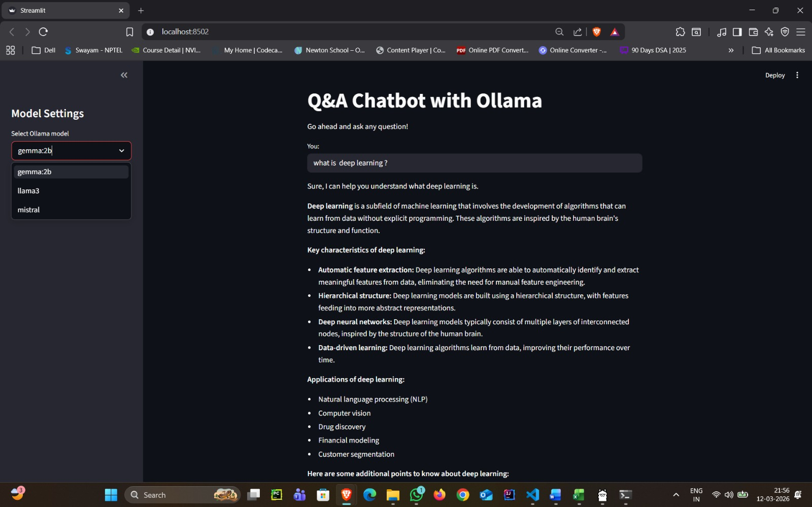

# 🤖 Q&A Chatbot with Ollama, LangChain, and Streamlit

A simple **GenAI chatbot application** built using **LangChain**, **Ollama**, and **Streamlit**.
The chatbot allows users to ask questions and get responses from locally running **LLM models** such as **Gemma, Llama3, and Mistral** via Ollama.

---

# 🚀 Features

* 🧠 Uses **Ollama Local LLMs**
* 🔗 Integrated with **LangChain**
* 💬 Interactive **Streamlit UI**
* ⚙️ Model selection from sidebar
* 📊 LangSmith tracing support
* 🖥️ Runs **fully locally (no OpenAI API required)**

---

# 🖼️ Application Preview



# 🏗️ Tech Stack

* **Python**
* **LangChain**
* **Ollama**
* **Streamlit**
* **LangSmith (Tracing)**
* **Dotenv**

---

# 📂 Project Structure

```
ollama-chatbot/
│
├── Ollama-chatbot.py      # Main Streamlit chatbot application
├── requirements.txt       # Project dependencies
├── .env                   # Environment variables
├── .gitignore             # Ignored files
└── README.md              # Project documentation
```

---

# ⚙️ Installation

## 1️⃣ Clone the repository

```bash
git clone https://github.com/your-username/ollama-chatbot.git
cd ollama-chatbot
```

---

## 2️⃣ Create Virtual Environment

```bash
python -m venv venv
```

Activate environment:

**Windows**

```bash
venv\Scripts\activate
```

**Mac/Linux**

```bash
source venv/bin/activate
```

---

## 3️⃣ Install Dependencies

```bash
pip install -r requirements.txt
```

---

# 🧠 Install Ollama

Download Ollama from:

👉 https://ollama.com/

Install required models:

```bash
ollama pull gemma:2b
ollama pull llama3
ollama pull mistral
```

Check installed models:

```bash
ollama list
```

---

# ▶️ Run the Application

```bash
streamlit run Ollama-chatbot.py
```

Then open the browser:

```
http://localhost:8501
```

---

# 💬 How It Works

1️⃣ User enters a question in the Streamlit UI
2️⃣ LangChain builds a **prompt template**
3️⃣ Ollama runs the selected **local LLM model**
4️⃣ Model generates a response
5️⃣ Streamlit displays the answer

Architecture:

```
User Input
    ↓
Streamlit UI
    ↓
LangChain Prompt Template
    ↓
Ollama Local LLM
    ↓
Response Output
```

---

# 📊 LangSmith Tracking (Optional)

If you want tracing enabled:

Create `.env` file:

```
LANGCHAIN_API_KEY=your_api_key
LANGCHAIN_PROJECT=Ollama Chatbot
```

---

# 🖼️ Demo

Example interface:

* Select model from sidebar
* Enter a question
* Get instant response from local LLM

---


---

# 👨‍💻 Author

**Shaik Zaid**

GenAI / Machine Learning Enthusiast
Building projects with **LangChain, LLMs, and AI systems**

---

# ⭐ Support

If you like this project:

⭐ Star the repository
🍴 Fork it

